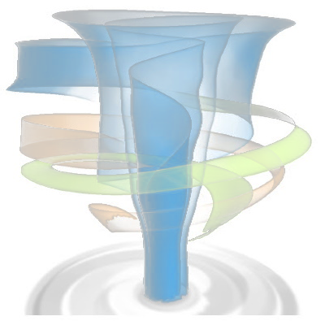

# NetCDF to 3D Volume Textures

Notebooks and web API to convert NetCDF file to 3D Textures. Specific functions include:

- Exploring the characteristics of NetDCDF datasets
- ...

# Documentation

to be completed

# Installation using Conda

**NOTE:** Use conda, not pip, with a new environment created with `environment.yml` file

**To use notebooks**, install the following...
- [**JupyterLab**](https://jupyterlab.readthedocs.io/en/stable/getting_started/installation.html): 
Should also work under Notebook
- [**NetCDF4**](https://github.com/Unidata/netcdf4-python):
DO not use PIP. Install using Conda-Forge at [link](https://github.com/conda-forge/netcdf4-feedstock)
- [**ipyvolume**](https://github.com/maartenbreddels/ipyvolume): 
Will require nodejs, threejs, and more. Enable extension manually. 

**To use REST web API**, install the following...
- [**NetCDF4**](https://github.com/Unidata/netcdf4-python):
Do not use PIP. Install using Conda-Forge at [link](https://github.com/conda-forge/netcdf4-feedstock)
- [**Flask**](https://flask.palletsprojects.com/en/1.1.x/): 
Follow instructions carefully. Not your normal Python. But lots of instructional tutorials available. 
